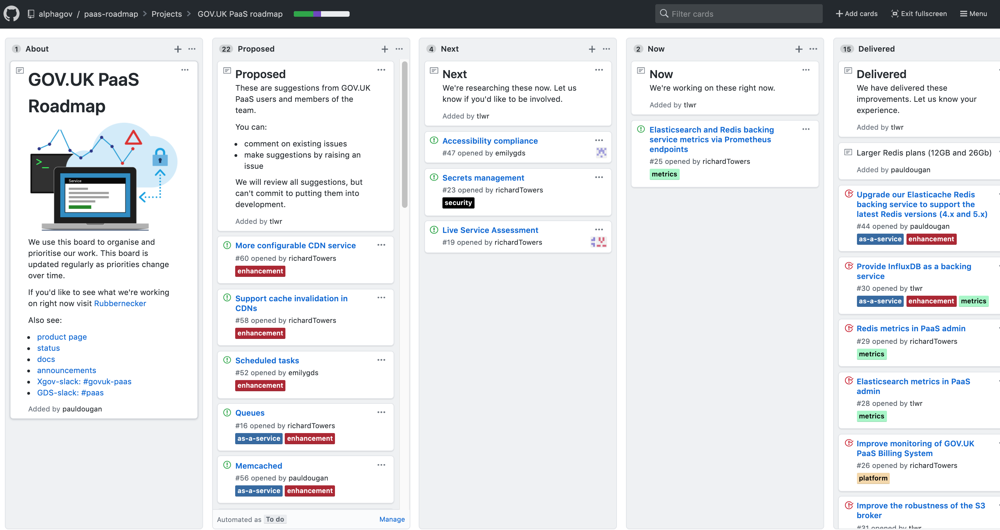

# GOV.UK PaaS roadmap

## About this repo

This is a place for the UK government community to coordinate the development
of new services and features for [GOV.UK Platform as a Service](https://www.cloud.service.gov.uk) (PaaS).

## The roadmap

> **[View the community roadmap](https://github.com/alphagov/paas-roadmap/projects/1?fullscreen=true)**

> view on your mobile by scanning this qrcode

## Contributing to the roadmap 

If you have any questions about the roadmap itself, you can:
- use the [#govuk-paas](https://ukgovernmentdigital.slack.com/messages/C33SAH4GJ) channel on [cross-government Slack](https://ukgovernmentdigital.slack.com/).
- email the GOV.UK PaaS Team at govuk-paas-support@digital.cabinet-office.gov.uk
- use the [support form](https://www.cloud.service.gov.uk/support/find-out-more)

You can contribute by discussing and proposing services.

